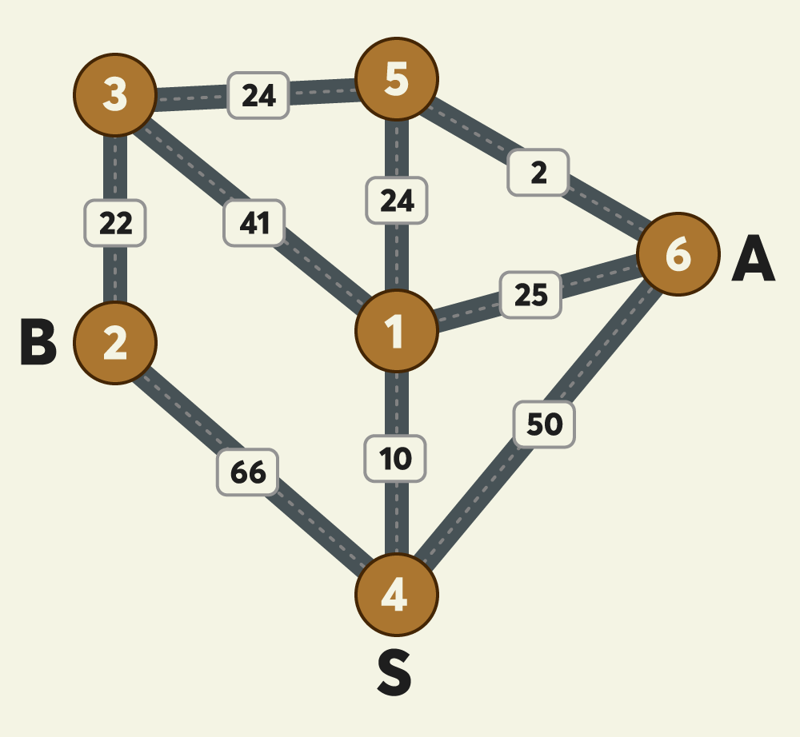
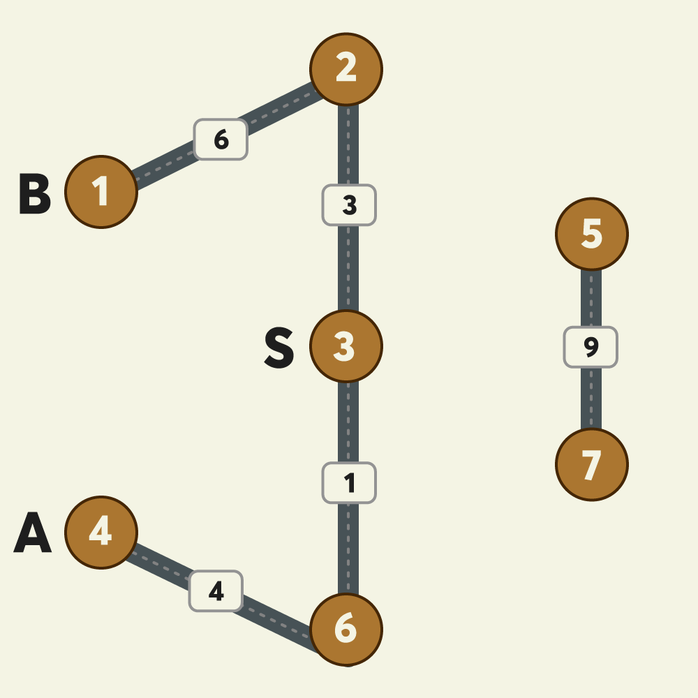
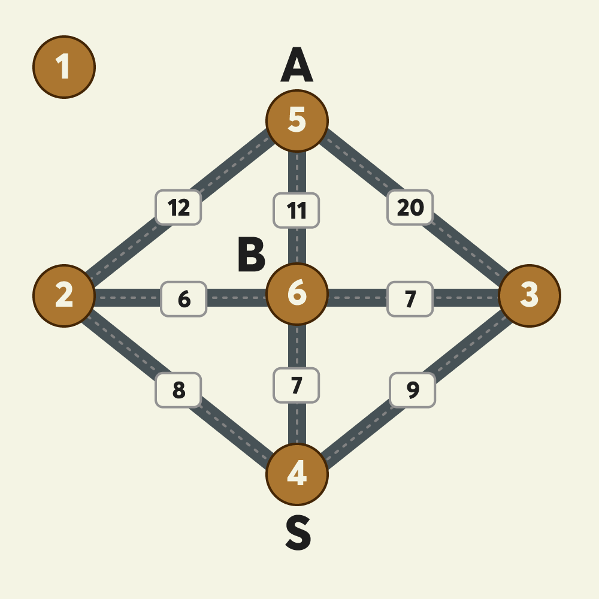

문제 설명

[본 문제는 정확성과 효율성 테스트 각각 점수가 있는 문제입니다.]
밤늦게 귀가할 때 안전을 위해 항상 택시를 이용하던 무지는 최근 야근이 잦아져 택시를 더 많이 이용하게 되어 택시비를 아낄 수 있는 방법을 고민하고 있습니다. "무지"는 자신이 택시를 이용할 때 동료인 어피치 역시 자신과 비슷한 방향으로 가는 택시를 종종 이용하는 것을 알게 되었습니다. "무지"는 "어피치"와 귀가 방향이 비슷하여 택시 합승을 적절히 이용하면 택시요금을 얼마나 아낄 수 있을 지 계산해 보고 "어피치"에게 합승을 제안해 보려고 합니다.

위 예시 그림은 택시가 이동 가능한 반경에 있는 6개 지점 사이의 이동 가능한 택시노선과 예상요금을 보여주고 있습니다.
그림에서 A와 B 두 사람은 출발지점인 4번 지점에서 출발해서 택시를 타고 귀가하려고 합니다. A의 집은 6번 지점에 있으며 B의 집은 2번 지점에 있고 두 사람이 모두 귀가하는 데 소요되는 예상 최저 택시요금이 얼마인 지 계산하려고 합니다.
그림의 원은 지점을 나타내며 원 안의 숫자는 지점 번호를 나타냅니다.
지점이 n개일 때, 지점 번호는 1부터 n까지 사용됩니다.
지점 간에 택시가 이동할 수 있는 경로를 간선이라 하며, 간선에 표시된 숫자는 두 지점 사이의 예상 택시요금을 나타냅니다.
간선은 편의 상 직선으로 표시되어 있습니다.
위 그림 예시에서, 4번 지점에서 1번 지점으로(4→1) 가거나, 1번 지점에서 4번 지점으로(1→4) 갈 때 예상 택시요금은 10원으로 동일하며 이동 방향에 따라 달라지지 않습니다.
예상되는 최저 택시요금은 다음과 같이 계산됩니다.
4→1→5 : A, B가 합승하여 택시를 이용합니다. 예상 택시요금은 10 + 24 = 34원 입니다.
5→6 : A가 혼자 택시를 이용합니다. 예상 택시요금은 2원 입니다.
5→3→2 : B가 혼자 택시를 이용합니다. 예상 택시요금은 24 + 22 = 46원 입니다.
A, B 모두 귀가 완료까지 예상되는 최저 택시요금은 34 + 2 + 46 = 82원 입니다.

[문제]
지점의 개수 n, 출발지점을 나타내는 s, A의 도착지점을 나타내는 a, B의 도착지점을 나타내는 b, 지점 사이의 예상 택시요금을 나타내는 fares가 매개변수로 주어집니다. 이때, A, B 두 사람이 s에서 출발해서 각각의 도착 지점까지 택시를 타고 간다고 가정할 때, 최저 예상 택시요금을 계산해서 return 하도록 solution 함수를 완성해 주세요.
만약, 아예 합승을 하지 않고 각자 이동하는 경우의 예상 택시요금이 더 낮다면, 합승을 하지 않아도 됩니다.
[제한사항]
지점갯수 n은 3 이상 200 이하인 자연수입니다.
지점 s, a, b는 1 이상 n 이하인 자연수이며, 각기 서로 다른 값입니다.
즉, 출발지점, A의 도착지점, B의 도착지점은 서로 겹치지 않습니다.
fares는 2차원 정수 배열입니다.
fares 배열의 크기는 2 이상 n x (n-1) / 2 이하입니다.
예를들어, n = 6이라면 fares 배열의 크기는 2 이상 15 이하입니다. (6 x 5 / 2 = 15)
fares 배열의 각 행은 [c, d, f] 형태입니다.
c지점과 d지점 사이의 예상 택시요금이 f원이라는 뜻입니다.
지점 c, d는 1 이상 n 이하인 자연수이며, 각기 서로 다른 값입니다.
요금 f는 1 이상 100,000 이하인 자연수입니다.
fares 배열에 두 지점 간 예상 택시요금은 1개만 주어집니다. 즉, [c, d, f]가 있다면 [d, c, f]는 주어지지 않습니다.
출발지점 s에서 도착지점 a와 b로 가는 경로가 존재하는 경우만 입력으로 주어집니다.

[입출력 예]
n	s	a	b	fares	result
6	4	6	2	[[4, 1, 10], [3, 5, 24], [5, 6, 2], [3, 1, 41], [5, 1, 24], [4, 6, 50], [2, 4, 66], [2, 3, 22], [1, 6, 25]]	82
7	3	4	1	[[5, 7, 9], [4, 6, 4], [3, 6, 1], [3, 2, 3], [2, 1, 6]]	14
6	4	5	6	[[2,6,6], [6,3,7], [4,6,7], [6,5,11], [2,5,12], [5,3,20], [2,4,8], [4,3,9]]

입출력 예에 대한 설명
입출력 예 #1
문제 예시와 같습니다.

입출력 예 #2

합승을 하지 않고, B는 3→2→1, A는 3→6→4 경로로 각자 택시를 타고 가는 것이 최저 예상 택시요금입니다.
따라서 최저 예상 택시요금은 (3 + 6) + (1 + 4) = 14원 입니다.

입출력 예 #3

A와 B가 4→6 구간을 합승하고 B가 6번 지점에서 내린 후, A가6→5` 구간을 혼자 타고 가는 것이 최저 예상 택시요금입니다.
따라서 최저 예상 택시요금은 7 + 11 = 18원 입니다.

--
이 문제는 다익스트라 알고리즘이나 플로이드-워셜 알고리즘을 활용하여 최단 거리를 계산하는 그래프 탐색 문제입니다.
핵심 아이디어
모든 지점 간 최단 거리를 구한 후, 합승을 어디까지 할지 결정하여 최소 비용을 계산합니다.
s → k → a + k → b와 같이 중간 지점 k까지 함께 가는 경우를 고려해야 합니다.
플로이드-워셜 알고리즘을 사용하면 모든 노드 간 최단 거리를 쉽게 계산할 수 있습니다.

코드 구현
초기화
dist[i][j] 배열을 만들어 모든 노드 간 최단 거리를 저장합니다.
자기 자신으로 가는 비용은 0으로 설정하고, 주어진 간선 정보를 반영합니다.
플로이드-워셜 알고리즘 적용
dist[i][j] = min(dist[i][j], dist[i][k] + dist[k][j])
이를 통해 모든 지점 간 최단 거리를 계산합니다.
최소 택시 요금 계산
s → k → a + s → k → b 형태의 경로를 고려하여 k를 1부터 n까지 탐색하며 최소 비용을 찾습니다.

시간 복잡도 분석
플로이드-워셜 알고리즘의 시간 복잡도: O(n³)
n이 최대 200이므로 최악의 경우 O(200³) = 8,000,000 연산으로 충분히 해결 가능합니다.
